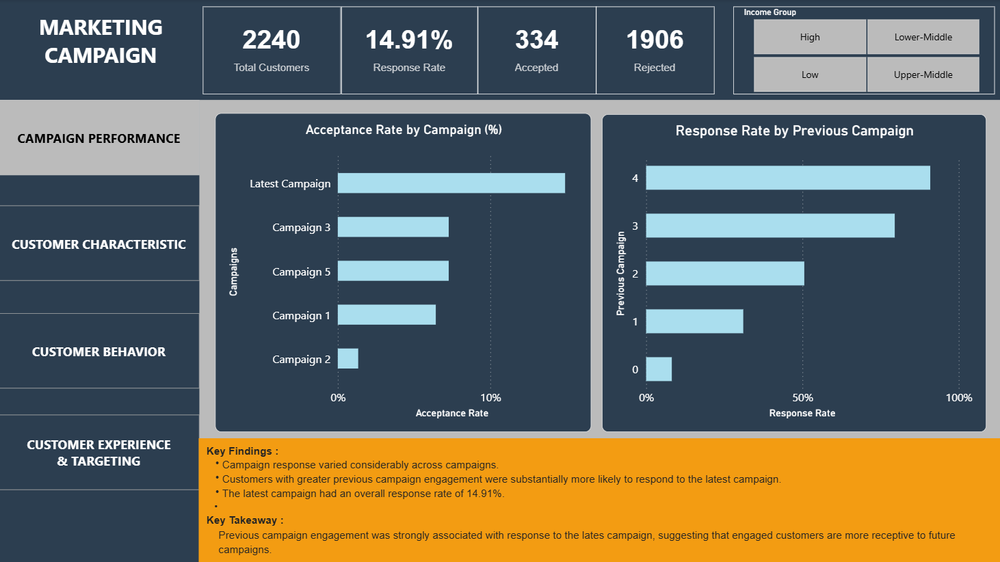
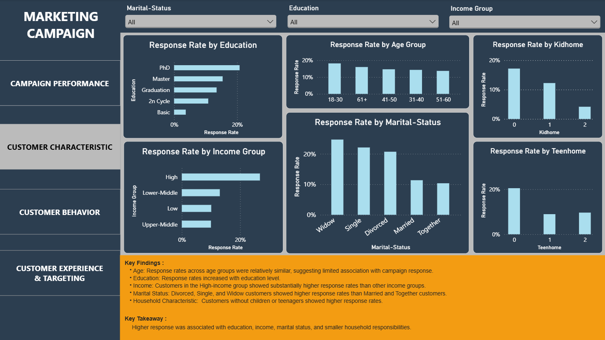
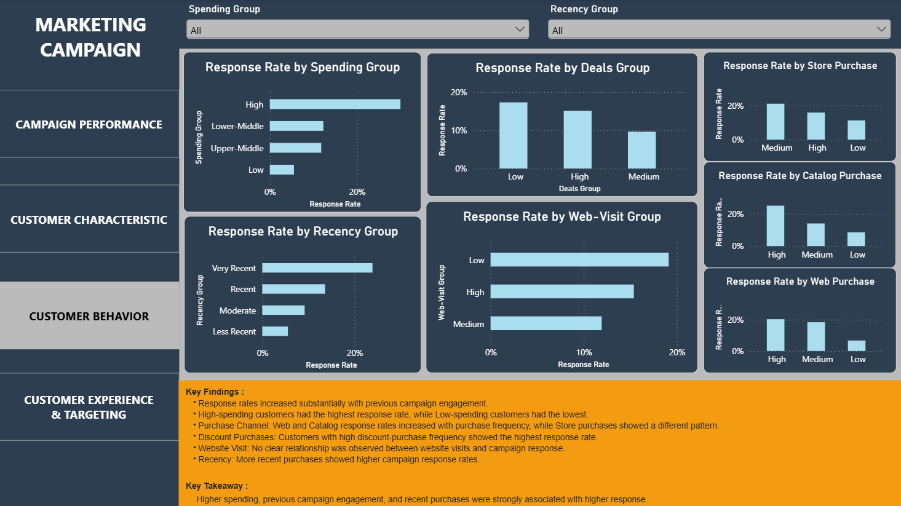
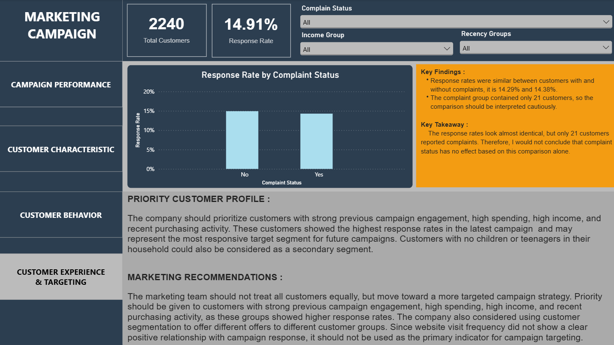

# Marketing Campaign Analysis

## Project Overview

This project analyzes customer data from a marketing campaign to identify **which customers are more likely to respond** and which customer characteristics and behaviors are associated with campaign response.

The project uses **Power Query for Data Cleaning**, **Python for additional cleaning and analysis** and **Power BI for interactive visualization and business insights**.

---

## Business Questions

* How did customers respond to the latest campaign?
* Which customer characteristics are associated with higher response?
* What customer behaviors are associated with higher response?
* Which customers should be prioritized for future campaigns?

---

## Tools

* Python
* Pandas
* NumPy
* Matplotlib
* Power BI
* Power Query

---

## Analysis

### 1. Campaign Performance

Analyzed campaign response and previous campaign engagement.

### 2. Customer Characteristics

Analyzed response rates by education, income, marital status, household characteristics, and age.

### 3. Customer Behavior

Analyzed spending, purchasing channels, discount purchases, website visits, and recency.

### 4. Customer Experience & Targeting

Analyzed complaint status and identified potential priority customer segments.

---

## Key Findings

* Latest campaign response rate: **14.91%**
* Previous campaign engagement was strongly associated with higher response.
* High-income and high-spending customers showed higher response rates.
* More recent customers generally showed higher response.
* Website visit frequency showed no clear relationship with response.

---

## Recommendations

* Prioritize high-income and high-spending customers.
* Target customers with stronger previous campaign engagement.
* Focus on recently active customers.
* Use customer characteristics and purchasing behavior for targeted segmentation.

---

## Project Files

* `01_marketing_campaign.csv` - Original dateset.
* `02_marketing_campaign_cleaned.csv` - Cleaned dataset used for analysis.
* `marketing_campaign_analysis.ipynb` - Exploratory data analysis.
* `Marketing Campaign Dashboard.pbix` - Visualizations.
---

## Repository Structure

```text
Marketing-Campaign-Analysis/ 
│ 
├── 1. Data/ 
│   ├── 01_marketing_campaign.csv 
│   └── 02_marketing_campaign_cleaned.csv 
│ 
├── 2. Notebook/ 
│   └── marketing_campaign_analysis.ipynb 
│ 
├── 3. Dashboard/ 
│   └── Marketing Campaign Dashboard.pbix 
│ 
├── 4. Images/ 
│   ├── 01_campaign_performance.png 
│   ├── 02_customer_characteristics.png 
│   ├── 03_customer_behavior.png 
│   └── 04_customer_experience_targeting.png 
│ 
└── README.md
```
---

## Dashboard

An interactive **Power BI dashboard** was created to explore campaign performance, customer characteristics, customer behavior, and targeting insights.

### Campaign Performance



### Customer Characteristics



### Customer Behavior



### Customer Experience & Targeting



---

## Dataset

The dataset contains customer demographics, household characteristics, purchasing behavior, campaign engagement, and campaign response data.

Dataset: Marketing Campaign
Source: Kaggle

---

## Author

Rezki Surahmi

Aspiring Data Analyst passionate about turning data into meaningful insights through analysis and visualization.

GitHub: https://github.com/rezkisr